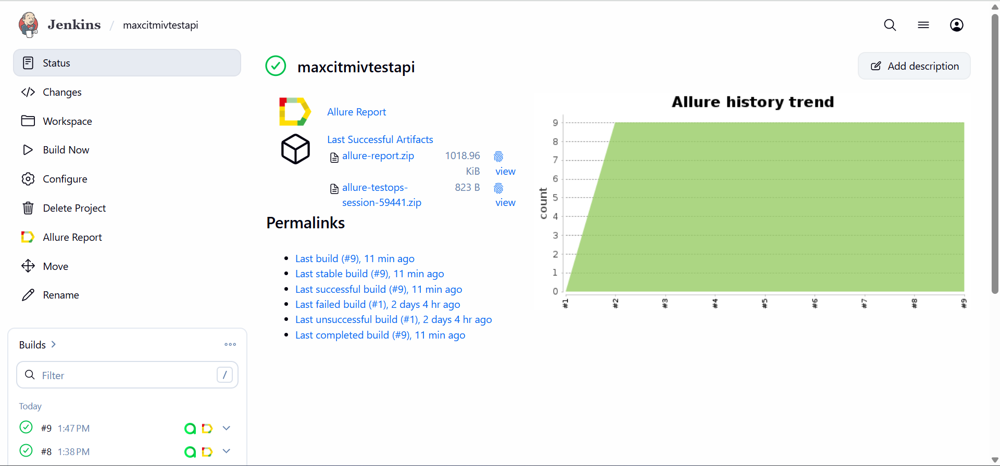
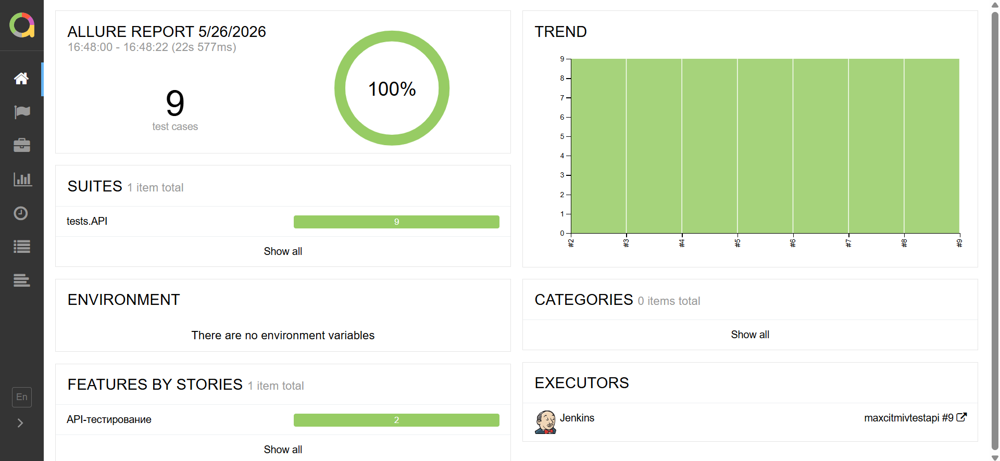
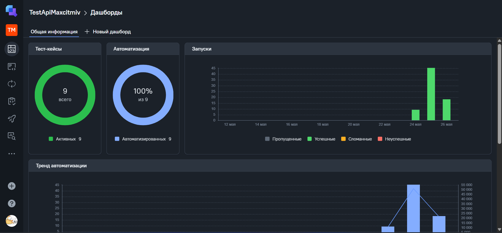
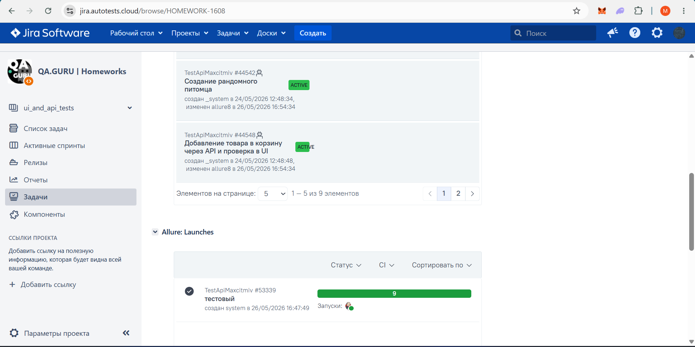
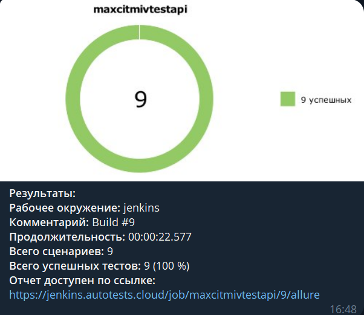
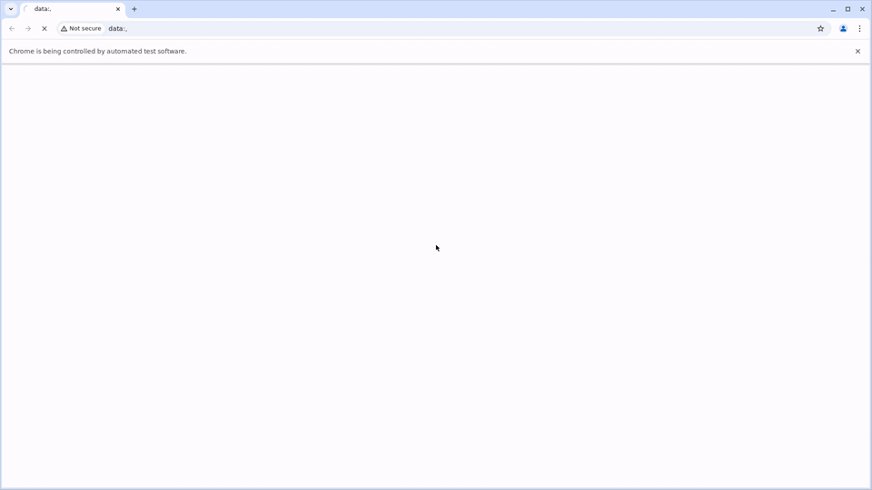

## Проект API и UI автотестов `TestApi`

### Используемые технологии
<p align="center">
  <code></code>
  <code></code>
  <code></code>
  <code></code>
  <code></code>
  <code></code>
  <code></code>
  <code></code>
  <code></code>
  <code></code>
  <code></code>
  <code></code>
</p>

### Что проверяем
* Создание питомца через `POST /pet`
* Получение созданного питомца через `GET /pet/{id}`
* Обновление данных питомца через `PUT /pet`
* Удаление питомца через `DELETE /pet/{id}`
* Негативные проверки для удаленного питомца
* Подготовка UI-состояния через API: добавление товара в корзину Demo Web Shop
* Удаление товара из корзины через API и проверка результата в UI

### Особенности проекта
* Все API-запросы выполняются через endpoint без указания базового URI в тестах
* Для request и response используются Pydantic-модели
* Request и response валидируются по JSON Schema
* Для каждого HTTP-запроса в Allure прикладываются `request` и `response`
* UI-тесты запускаются локально или удаленно через Selenoid
* По результатам прогона формируются Allure Report, Allure TestOps launch и Telegram-уведомление

### Подготовка и запуск
```powershell
python -m venv .venv
.\.venv\Scripts\Activate.ps1
pip install poetry
poetry install
poetry run pytest
```

`.env` (в корне проекта):
```env
PETSTORE_BASE_URL=https://petstore.swagger.io/v2
DEMO_WEBSHOP_BASE_URL=https://demowebshop.tricentis.com

SELENOID_URL=https://selenoid.autotests.cloud/wd/hub
SELENOID_VIDEO_URL=https://selenoid.autotests.cloud/video
SELENOID_LOGIN=your_selenoid_login
SELENOID_PASSWORD=your_selenoid_password

BROWSER_NAME=chrome
BROWSER_VERSION=125.0
HEADLESS=false
```

###  Запуск проекта в Jenkins

### [Job](https://jenkins.autotests.cloud/job/maxcitmivtestapi/)

##### При нажатии на "Build Now" запускается сборка и прогон API и UI-тестов. UI-сценарии выполняются в удаленном браузере через Selenoid.


###  Allure report

### [Allure report build #9](https://jenkins.autotests.cloud/job/maxcitmivtestapi/9/allure/)

##### В отчете доступны шаги теста, вложения request/response для API-запросов и артефакты браузера для UI-сценариев.


###  Интеграция с Allure TestOps

### [Dashboard](https://allure.autotests.cloud/project/5220/dashboards)

##### Результаты прогонов сохраняются в Allure TestOps с дашбордами по тест-кейсам, автотестам и запускам.


###  Интеграция с Jira

##### Через интеграцию можно связывать автотесты и результаты прогонов с задачами в Jira.


###  Интеграция с Telegram

##### После завершения прогона бот отправляет краткий отчет с итогами и ссылкой на Allure.


### Видео прогона теста

### [Selenoid video](https://selenoid.autotests.cloud/video/test_delete_item_from_cart.mp4)


